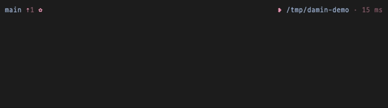
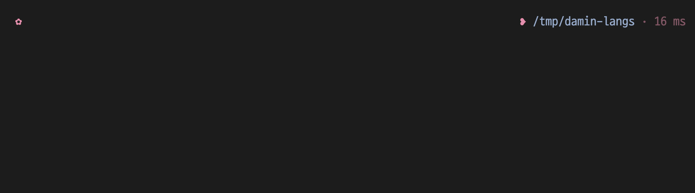

# fish-theme-damin

> Small, opinionated fish prompt. Florette (`✿`) left, heart bullet (`❥`) right, two-color palette (`#98ABCC` / `#E890B0`). Pure dingbats — no Nerd Font required. Works with [Fisher][fisher] and [Oh My Fish][omf].

## Preview

Git workflow — counts, transient prompt, duration, exit code:



Language detection, vi mode, custom segment:



```
master ✗3 ✓1 #42 [N] ✿                        ❥ ~/code · node:22 · 120 ms
master (rebase) wt:feat-x X2 ✿                ❥ ~/code · 50 ms
ssh aws:prod@us-east-1 master ✿               ❥ ~/foo · py:3.12 · 250 ms
master ✿ SIGINT                                          ❥ ~/bug · 3.2 s
```

After Enter, past prompts collapse to `✿` so scrollback stays tidy.

## Install

Requires **fish ≥ 3.7** (for the `path mtime` builtin).

**Fisher**

```fish
fisher install miniex/fish-theme-damin
```

**Oh My Fish**

```fish
omf install https://github.com/miniex/fish-theme-damin
omf theme fish-theme-damin
```

**Local hacking — Fisher**

```fish
git clone https://github.com/miniex/fish-theme-damin.git
fisher install (pwd)/fish-theme-damin
```

**Local hacking — Oh My Fish**

```fish
git clone https://github.com/miniex/fish-theme-damin.git
ln -sfn (pwd)/fish-theme-damin ~/.local/share/omf/themes/fish-theme-damin
omf theme fish-theme-damin
```

## Highlights

- **Fast** — sub-millisecond hot path, caches + event-driven invalidation
- **git / jj** — counts (`X2 ?2 ✗3 ✓1 ⇡N`), op state (`(rebase)`), `wt:<name>`, unmerged-first, opt-in `#N` GitHub PR
- **Context** — `ssh` / `root` / `dkr` / `ctr` / `k8s:<ctx>/<ns>`, opt-in `aws:<profile>@<region>` / `gcp:<project>` / `az:<sub>`. Pure-fish, no CLI forks
- **Lang + env** — 10 langs (`node:22`, `py:3.12`, `rb:3.3`, …) via pin files first. Active `(.venv)` / `(conda)` / `(direnv:<dir>)` / `(nix:<devshell>)`
- **Terraform / Pulumi** — opt-in `tf:<workspace>` / `pulumi:<stack>`
- **Terminal-native** — OSC 7 (cwd advertise) + OSC 133 (semantic prompt markers), opt-in long-command desktop alert (OSC 9 + `notify-send`)
- **9 palettes** — Catppuccin (mocha/frappe/macchiato/latte) + gruvbox / tokyonight / rosepine / nord / dracula. Live switch via `damin_set_palette`. `damin_install_themes` exports them for `fish_config theme show`
- **Transient prompt**, **vi-mode badge**, **ASCII fallback**, **TRAMP / dumb auto-minimal**
- **Customizable** — 35+ `theme_damin_*` toggles, custom `damin_segment_<name>` hooks for the left / right prompt

## Commands

| Command                | Purpose                                                                |
|------------------------|------------------------------------------------------------------------|
| `damin_config`         | Interactive setup wizard                                               |
| `damin_help`           | List every toggle, current value, default                              |
| `damin_doctor`         | Environment + install diagnostic                                       |
| `damin_profile`        | Per-segment ms/render timer                                            |
| `damin_set_palette`    | Switch palette                                                         |
| `damin_install_themes` | Write `.theme` files into `~/.config/fish/themes/`                     |
| `damin_reset_cache`    | Wipe on-disk cache                                                     |

## Configuration

Everything is a `theme_damin_*` universal variable. Run `damin_help` for the full list. Full reference, palette details, performance numbers, and cache architecture in [docs/ARCHITECTURE.md](docs/ARCHITECTURE.md).

```fish
set -U theme_damin_show_jobs 0
```

## Troubleshooting

Nuke and reinstall.

**Fisher**

```fish
damin_reset_cache
fisher remove miniex/fish-theme-damin
fisher install miniex/fish-theme-damin
exec fish
```

**Oh My Fish**

```fish
damin_reset_cache
omf theme default; and rm -rf ~/.local/share/omf/themes/fish-theme-damin
omf install https://github.com/miniex/fish-theme-damin; and omf theme fish-theme-damin
exec fish
```

Run `damin_doctor` if anything still looks off. `Conflicting prompt setting` after a reinstall = stale symlink — `hooks/install.fish` handles this automatically; on older installs, `rm ~/.config/fish/functions/fish_prompt.fish; omf theme fish-theme-damin`.

## Contributing

PRs welcome. Run `./tools/format.sh`, `./tools/lint.sh`, `./tools/test.sh`. Hot-path changes need before / after `./tools/bench.sh` numbers. See [CONTRIBUTING.md](CONTRIBUTING.md).

## Changelog

See [CHANGELOG.md](CHANGELOG.md). Current version: **1.1.0**.

## License

[MIT](LICENSE) © 2026 Han Damin. Bundled palette hex values are MIT-licensed third-party color schemes (Catppuccin, Gruvbox, Tokyo Night, Rosé Pine, Nord, Dracula) — see [`LICENSES/`](LICENSES/).

[fisher]: https://github.com/jorgebucaran/fisher
[omf]:    https://github.com/oh-my-fish/oh-my-fish
