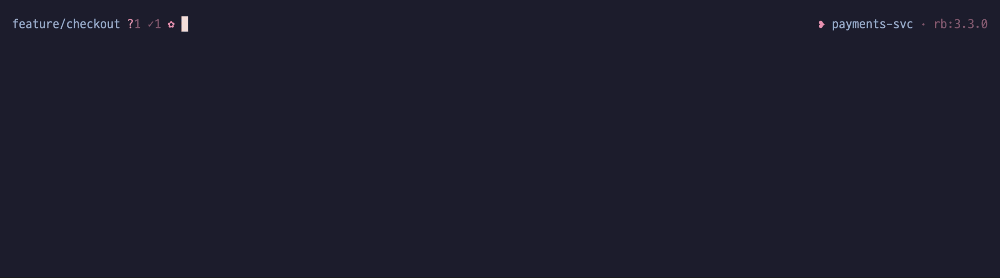
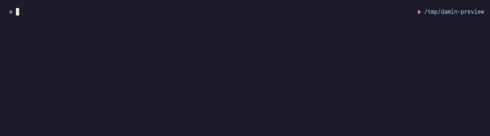

# fish-theme-damin

> Small, opinionated fish prompt. Florette (`✿`) left, heart bullet (`❥`) right, two-color palette (`#98ABCC` / `#E890B0`). Pure dingbats — no Nerd Font required. Works with [Fisher][fisher] and [Oh My Fish][omf].

## Preview

Git workflow — counts, op state, conflict, duration, exit code. Past prompts collapse to `✿` after Enter:


Language detection, env (`.venv` / `nix`), vi mode, custom segment:


Cloud + DevOps — `aws:<profile>@<region>` / `k8s:<ctx>/<ns>` / `tf:<workspace>` / `pulumi:<stack>`:


Palette switching — 19 flavors, live via `damin_set_palette`, preview-before-apply with `damin_palette_preview`:



Beyond git — Jujutsu (`jj`), Mercurial (`hg`), and Fossil all render in the same prompt:



## Install

Requires **fish ≥ 3.7** (for the `path mtime` builtin).

**Fisher**

```fish
fisher install miniex/fish-theme-damin
```

**Oh My Fish**

```fish
omf install damin
omf theme damin
```

## What you get

- **Fast** — ~0.5 ms/prompt. In-memory PWD memos, async refresh in a ~3 KB subshell, opt-out `-uno` for monorepos
- **git / jj / hg / fossil** — counts, op state, worktree, opt-in `#N` GitHub PR badge, branch issue-key auto-link
- **Context** — `ssh` / `root` / `dkr` / `tmux` / `wsl` / `k8s` / opt-in `aws` / `gcp` / `az`. Pure-fish, no CLI forks
- **19 palettes**, live switch + preview without applying. OSC 7 / 8 / 133 shell integration. Custom segment hooks
- **70+ toggles**, configurable right-prompt order, ASCII fallback + optional Nerd Font preset, dumb-terminal auto-minimal

Full feature reference + every command + every toggle: **[docs/USAGE.md](docs/USAGE.md)**. Internals (cache layers, async IPC, palette plumbing): **[docs/ARCHITECTURE.md](docs/ARCHITECTURE.md)**.

## Update

**Fisher**

```fish
fisher update miniex/fish-theme-damin
```

**Oh My Fish**

```fish
omf update damin
```

## Troubleshooting

Nuke and reinstall.

**Fisher**

```fish
damin_reset_cache
fisher remove miniex/fish-theme-damin
fisher install miniex/fish-theme-damin
exec fish
```

**Oh My Fish**

```fish
damin_reset_cache
omf theme default; and rm -rf ~/.local/share/omf/themes/damin
omf install damin; and omf theme damin
exec fish
```

Run `damin_doctor` (or `damin_doctor --fix` to auto-resolve safe items) if anything looks off.

## Companion repos

- [btop-theme-damin](https://github.com/miniex/btop-theme-damin) — btop theme
- [dotfiles.tmux](https://github.com/miniex/dotfiles.tmux) — tmux config
- [dotfiles.kitty](https://github.com/miniex/dotfiles.kitty) — kitty terminal config
- [dotfiles.nvim](https://github.com/miniex/dotfiles.nvim) — Neovim config

## Contributing

PRs welcome. Run `./tools/format.sh`, `./tools/lint.sh`, `./tools/test.sh`. Hot-path changes need before / after `./tools/bench.sh` numbers. See [CONTRIBUTING.md](CONTRIBUTING.md).

## Changelog

See [CHANGELOG.md](CHANGELOG.md). Current version: **1.3.0**.

## License

[MIT](LICENSE) © 2026 Han Damin. Bundled palette hex values are MIT-licensed third-party color schemes (Catppuccin, Gruvbox, Tokyo Night, Rosé Pine, Nord, Dracula) — see [`LICENSES/`](LICENSES/).

[fisher]: https://github.com/jorgebucaran/fisher
[omf]: https://github.com/oh-my-fish/oh-my-fish
