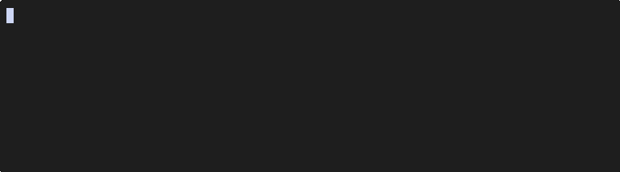

# fish-theme-damin

> A small, opinionated fish prompt — works with [Fisher][fisher] and [Oh My Fish][omf]. Florette (`✿`) on the left, heart bullet (`❥`) on the right, two-color palette (`#98ABCC` / `#E890B0`). Pure Dingbats — no Nerd Font required.

## Preview



```
master ✗3 ✓1 #42 [N] ✿                        ❥ ~/code · node:22 · 120 ms
master (rebase) wt:feat-x X2 ✿                ❥ ~/code · 50 ms
ssh aws:prod@us-east-1 master ✿               ❥ ~/foo · py:3.12 · 250 ms
master ✿ SIGINT                                          ❥ ~/bug · 3.2 s
```

After Enter, past prompts collapse to just `✿` so scrollback stays tidy.

## Install

**Fisher**

```fish
fisher install miniex/fish-theme-damin
```

**Oh My Fish**

```fish
omf install https://github.com/miniex/fish-theme-damin
omf theme fish-theme-damin
```

For local hacking:

```fish
git clone https://github.com/miniex/fish-theme-damin.git
# fisher
fisher install (pwd)/fish-theme-damin
# OR omf
ln -sfn (pwd)/fish-theme-damin ~/.local/share/omf/themes/fish-theme-damin
omf theme fish-theme-damin
```

Requires **fish ≥ 3.7** (for the `path mtime` builtin). Works with **Fisher** (auto-loads via `conf.d/` + `functions/`) and **Oh My Fish** (root shims source the same code).

## Highlights

- **Sub-millisecond hot path** — caches + event-driven invalidation. No background forks on every prompt
- **Smart git/jj integration** — counts (`X2 ?2 ✗3 ✓1`), op state (`(rebase)`), `wt:<name>` inside `git worktree`, jj support, postexec invalidation that skips read-only commands. Unmerged files surface first in bold red. Optional `#N` for the current branch's open GitHub PR (via `gh`, cached)
- **Context indicators** — `ssh`, `root`, `dkr`, `ctr` plus `k8s:<context>` (parsed from `~/.kube/config` / `$KUBECONFIG`; pure-fish, no `kubectl` fork) with optional `/<namespace>`. `&N` for background jobs
- **Cloud context** — opt-in `aws:<profile>@<region>` (env + `~/.aws/config`), `gcp:<project>` (`~/.config/gcloud/`), `az:<subscription>` (env + `~/.azure/azureProfile.json`). Pure-fish, mtime-cached, no CLI forks
- **Language + env** — `node:22`, `rust:1.78`, `py:3.12`, etc. with active `(.venv)` / `(conda)` / `(direnv:<dir>)` / `(nix:<devshell>)` display — direnv shows the project dir, `nix:` shows the flake's `name` attr
- **Terminal-native shell integration** — OSC 7 (advertises cwd so new tabs/splits open in the same directory) + OSC 133 (semantic prompt markers for "jump to prompt" / "select command output" in Ghostty, iTerm2, Kitty, WezTerm, VS Code, Windows Terminal). Unsupporting terminals silently ignore; opt out via `theme_damin_osc_integration 0`
- **Long-command notification** — opt-in desktop alert (OSC 9 + `notify-send`) when a command runs longer than `theme_damin_notify_threshold` (default 30 s). Walk away, the prompt taps you back
- **Exit-code labels** — `theme_damin_show_exit_code` is an enum: `number` (default), `name` (`SIGINT` / `not-found` / `SIGKILL` via fish's `fish_status_to_signal`), `both`, or `off`
- **Vi mode badge** — `[N]` / `[I]` / `[V]` / `[R]` shown next to the florette when `fish_vi_key_bindings` is active; auto-repaints on mode change. Off entirely under emacs bindings
- **Catppuccin palette swap** — `theme_damin_palette` selects between `mocha` (default), `frappe`, `macchiato`, `latte`. Switch live with `damin_set_palette frappe`
- **`fish_config` integration** — `damin_install_themes` writes `Damin Mocha` / `Frappe` / `Macchiato` / `Latte` `.theme` files into `~/.config/fish/themes/` so they show up in `fish_config theme show` (generated inline — no extra files in the repo to keep in sync)
- **Async cache warmup** — when fish opens directly into a repo, a background fork pre-fills the git cache so the next prompt is already hot
- **True async repaint** (opt-in) — `theme_damin_async_repaint 1` renders immediately on stale or missing git cache, runs the refresh in a `fish -c` subshell, then triggers `commandline -f repaint` once the fresh data is on disk. Useful for very large repos where porcelain v2 takes meaningful time
- **Auto-minimal on TRAMP / dumb terminals** — `$TERM=dumb` or `$INSIDE_EMACS` set ⇒ ascii glyphs, no transient, no OSC, no palette mutation, all without nuking user-explicit settings
- **Transient prompt** — past prompts collapse to `✿` after Enter
- **ASCII fallback** — if your terminal font is missing dingbats (`⇡ ⇣ ❥ ✧`), `set -U theme_damin_ascii 1` swaps every glyph for safe ASCII; or override one at a time via `theme_damin_glyph_*`
- **Interactive setup** — `damin_config` wizard walks you through the high-value toggles. `damin_help` is the full reference; the wizard is the onramp
- **Custom segments** — `set -U theme_damin_extra_left mything` and define `function damin_segment_mything; …; end`. Same for `_right`. Drop-in extension without forking
- **35+ toggles** via `set -U theme_damin_*` — run `damin_help` to discover

## Commands

| Command                | Purpose                                                                       |
|------------------------|-------------------------------------------------------------------------------|
| `damin_config`         | Interactive setup wizard — walkthrough of the high-value toggles              |
| `damin_help`           | List every toggle, current value, and default                                 |
| `damin_doctor`         | Environment, install, font-width, and prompt-source diagnostic                |
| `damin_set_palette`    | Switch the catppuccin flavor (`mocha` / `frappe` / `macchiato` / `latte`)     |
| `damin_install_themes` | Install bundled `.theme` files so `fish_config theme show` lists them         |
| `damin_reset_cache`    | Wipe the on-disk cache when something looks wrong                             |

## Configuration

Everything is gated by a `theme_damin_*` universal variable. Quick example — turn off jobs counter:

```fish
set -U theme_damin_show_jobs 0
```

Full toggle reference, palette, performance numbers, and cache architecture in [docs/ARCHITECTURE.md](docs/ARCHITECTURE.md).

## Troubleshooting

Something looks stale or wrong after an update? Nuke and reinstall:

```fish
# 1. clear the on-disk cache
damin_reset_cache
# OR — if the function is missing or broken, delete the dir yourself
rm -rf ~/.cache/damin

# 2. uninstall
fisher remove miniex/fish-theme-damin   # Fisher
# OR — OMF: switch off the theme, then delete the dir yourself
#         (omf remove can leave stale theme files behind)
omf theme default
rm -rf ~/.local/share/omf/themes/fish-theme-damin

# 3. reinstall
fisher install miniex/fish-theme-damin  # Fisher
# OR
omf install https://github.com/miniex/fish-theme-damin; and omf theme fish-theme-damin

# 4. apply in the current shell
exec fish
```

Still off? Run `damin_doctor` — it reports cache state, font width, where `fish_prompt` is loaded from, and any stray prompt files in `~/.config/fish/functions/`. The prompt definitions live in `conf.d/damin.fish`, not in `functions/`, so Fisher never copies a `fish_prompt.fish` into your autoload dir and switching between Fisher / OMF doesn't leave a `Conflicting prompt setting` behind.

## Contributing

PRs welcome. Install `fish` (`fish_indent`), `shfmt`, `shellcheck`, then run `./tools/format.sh`, `./tools/lint.sh`, and `./tools/test.sh`. See [CONTRIBUTING.md](CONTRIBUTING.md) for the commit-prefix convention. Hot-path changes should include before/after `./tools/bench.sh` numbers in the PR description.

## Changelog

See [CHANGELOG.md](CHANGELOG.md). Current version: **1.0.0**.

## License

[MIT](LICENSE) © 2026 Han Damin.

Third-party licenses live in [`LICENSES/`](LICENSES/). The bundled `fish_color_*` palettes and the four `Damin *.theme` files written by `damin_install_themes` use the [Catppuccin](https://github.com/catppuccin/catppuccin) Mocha, Frappé, Macchiato, and Latte hex codes (MIT, © 2021 Catppuccin). Values verified against the authoritative [`catppuccin/palette`](https://github.com/catppuccin/palette) `palette.json`.

[fisher]: https://github.com/jorgebucaran/fisher
[omf]:    https://github.com/oh-my-fish/oh-my-fish
